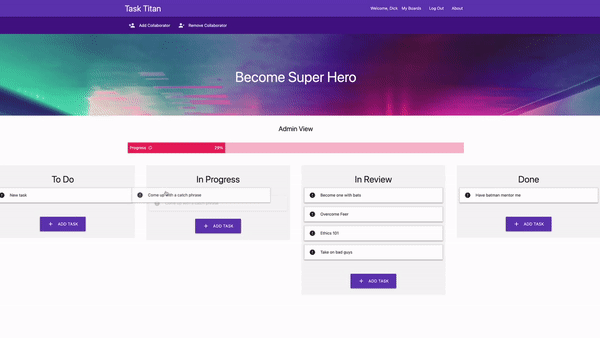

# Task-Titan
A UC Berkley Full Stack Web Development Bootcamp Project 02

## Description

A website where you can create, track, edit, delete, and complete tasks. Use Task Titan to CRUSH your tasks to build awesome projects!

## Heroku Deployment

[Task Titan Deployment](https://task-titan-bec51c55ebe5.herokuapp.com/)

## Project Presentation
[Google Slides](https://docs.google.com/presentation/d/1zrSl7t5zOl7puV-NsBfD0X0r-9z4GByRpmwSzZSQFi4/edit#slide=id.p)

## Visuals

## Usage

This page is used for grading purposes by the UC Berkley coding bootcamp staff.

## Credits
- Team Titan
    - Arun Ayyasamy - <a href="https://github.com/arundvp" target="_blank">arundvp</a>
    - Avery Myers - <a href="https://github.com/AveryJMyers" target="_blank">AveryJMyers</a>
    - Edward Von Schondorf - <a href="https://github.com/Torvec" target="_blank">Torvec</a>
    - Jake Krauskopf - <a href="https://github.com/JaKrau" target="_blank">JaKrau</a>
    - Mark Thostesen - <a href="https://github.com/markthos" target="_blank">markthos</a>
    - Will Cobb - <a href="https://github.com/1willcobb" target="_blank">1willcobb</a>

## Features

- Project Managers can ...
    - Create multiple projects
    - Add, update, delete, and complete task tickets
    - Add/remove Collaborators
    - Drag and Drop tickets into different categories
- Workers can ...
    - Add, Update, Comment, and move tasks
- Clients can ...
    - View tasks and comment on each ticket

## Project Status

Completed August 2023